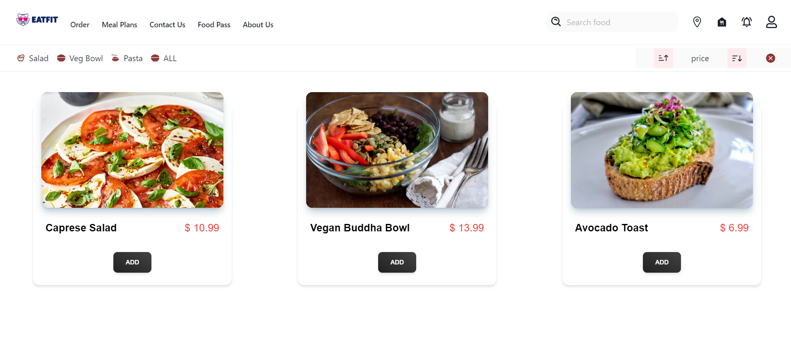
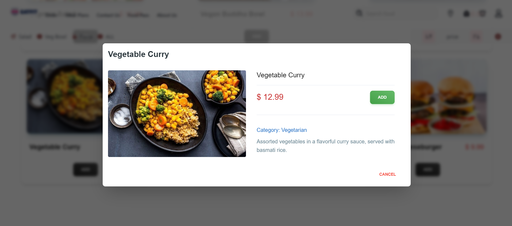
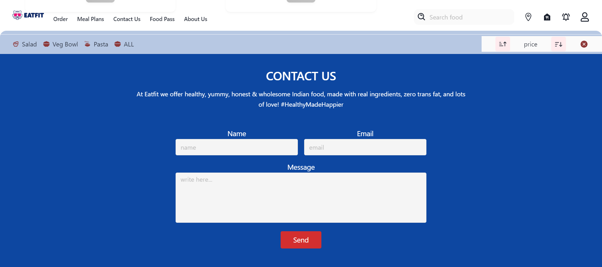

## EatFit

EatFit offers you not only a nutritious, preservative-free meal, but also a variety of cuisines to choose from, and menus that change regularly. Each dish is filled with quality ingredients, packed with flavor, and has nutritional information sitting atop it; to remind you that healthy eating can be enjoyable.

## Deployed on Vercel:

- link: https://eat-bszdbnxzr-vaishnavvidhi2312-gmailcom.vercel.app/

# Different Sections of Website
### Homepage

### Order

### Contact-Us

## TechStacks:

- ReactJS
- Tailwind CSS
- AOS
- Chankra UI
- Vercel
- Cyclic

### How to run the Project locally
### Install

Follow the following steps to get development environment running.

* Clone repository from GitHub

  bash
  git clone https://github.com/KrishnaVaishnav98/eat-fit
  

   OR USING SSH

  bash
  git clone git@github.com:KrishnaVaishnav98/eat-fit.git

### Starting front-end servers

* Build application

  bash
  npm install
  npm start
  
---

